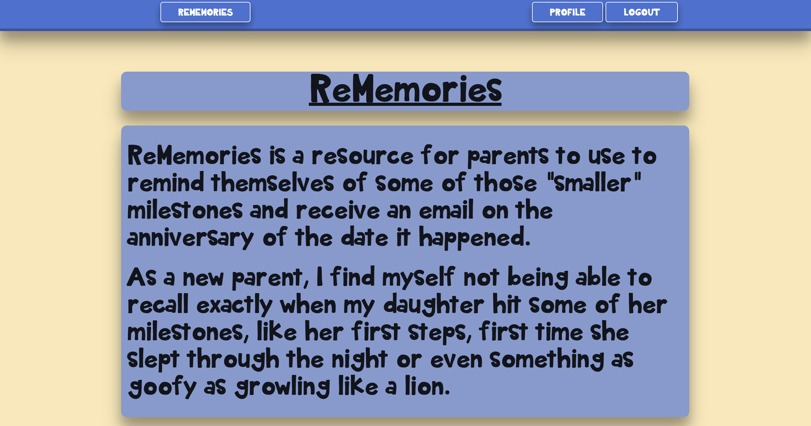

# ReMemories

##Purpose of ReMemories
As a new parent myself I find myself not being able to remember exactly when my daughter hit some of her growth milestones.  This is a resource for parents to use in order to have a log of some of those "smaller" milestones and receive an email a year after it happened.

##New Features
I decided to research how to get an email to be sent to a user automatically.  I utilized the built-in Rails feature Action Mailer to actually send the emails.  I also used the Gem delayed job to have emails sent in the future at a specific time.

I used Materialize to get a break from Bootstrap and found it fairly straight forward to implement the features I wanted.  I used SCSS with the Materialize Gem to nest my classes and target the elements I wanted.

##Technologies Used
- Rails
- Javascript
- Materialize
- SCSS
